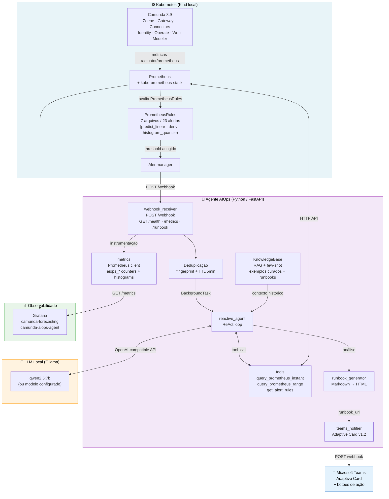

# Arquitetura de Componentes — camunda-aiops

Visão geral de todos os componentes do sistema e como eles se conectam.

---

## Decisões arquiteturais relevantes

| Decisão | Justificativa |
|---|---|
| **Vendor neutrality (SDK OpenAI)** | Trocar o LLM exige apenas 2 variáveis de ambiente — sem mudança de código |
| **Webhook assíncrono (202)** | Alertmanager recebe confirmação imediata; LLM processa em background sem travar a fila |
| **Deduplicação por fingerprint** | Evita análises repetidas durante `repeatInterval` do Alertmanager |
| **RAG sem vetordb** | `KnowledgeBase` própria com scoring por sobreposição de tokens — zero dependência externa |
| **Prometheus client no agente** | O próprio agente expõe métricas — observabilidade da camada AIOps sem infraestrutura adicional |
