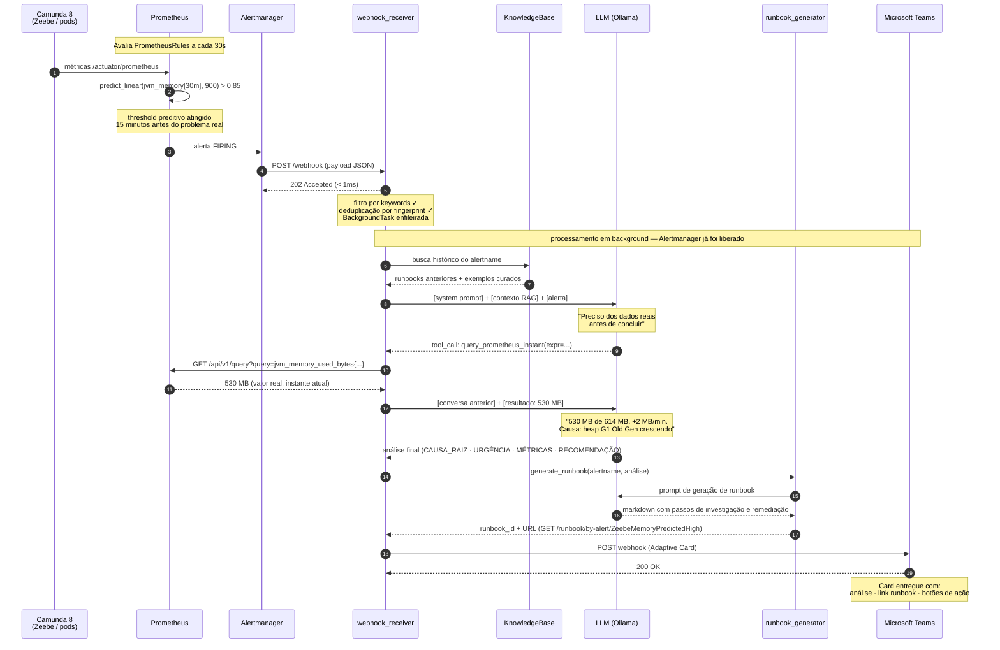

# Fluxo Completo do Alerta

Do forecasting preditivo no Prometheus até o card de análise no Microsoft Teams.

---

## Pontos-chave do fluxo

**Forecasting vs reativo:**  
O alerta é disparado por `predict_linear` — o Prometheus projeta que a métrica vai ultrapassar o threshold em 15 minutos, não que já ultrapassou. O time recebe o aviso *antes* do problema.

**202 imediato:**  
O Alertmanager recebe a confirmação em menos de 1ms. O processamento (LLM + Prometheus + Teams) acontece depois, em background. O Alertmanager nunca fica esperando o LLM terminar.

**Dados reais, não estimativas:**  
O valor "530 MB" no card não é inventado pelo LLM — é o dado coletado do Prometheus no momento do alerta (passo 10). O LLM usa esse dado para fundamentar a análise.

**RAG melhora com o tempo:**  
Cada runbook gerado (passo 14) é armazenado na `KnowledgeBase`. Na próxima ocorrência do mesmo alerta, o agente já tem o histórico de análises anteriores como referência.
