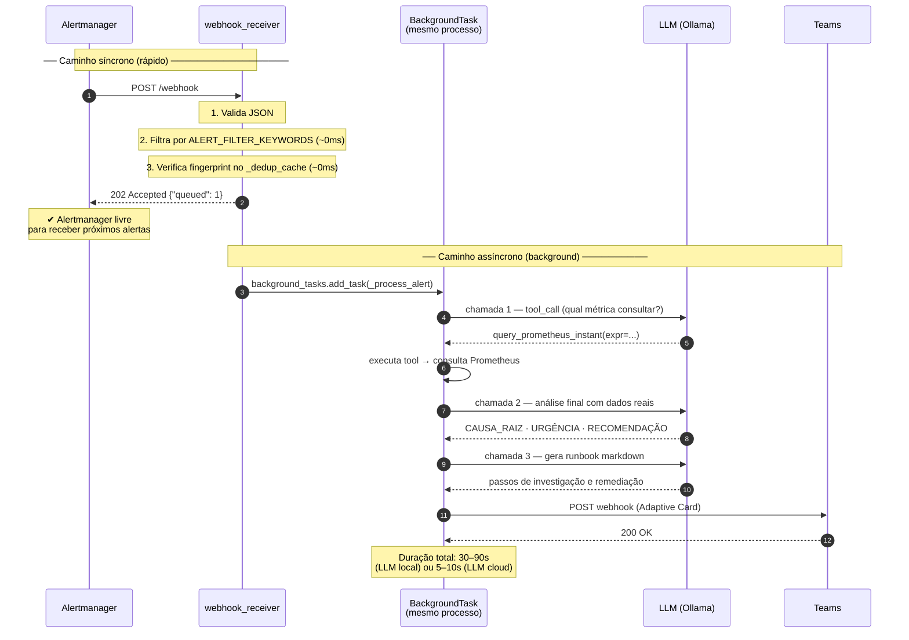
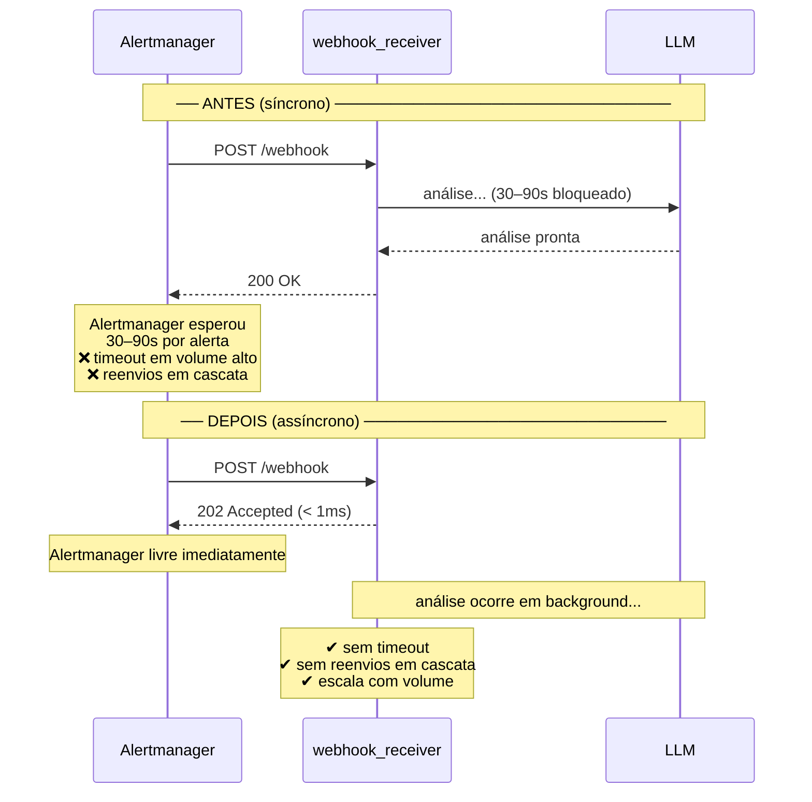
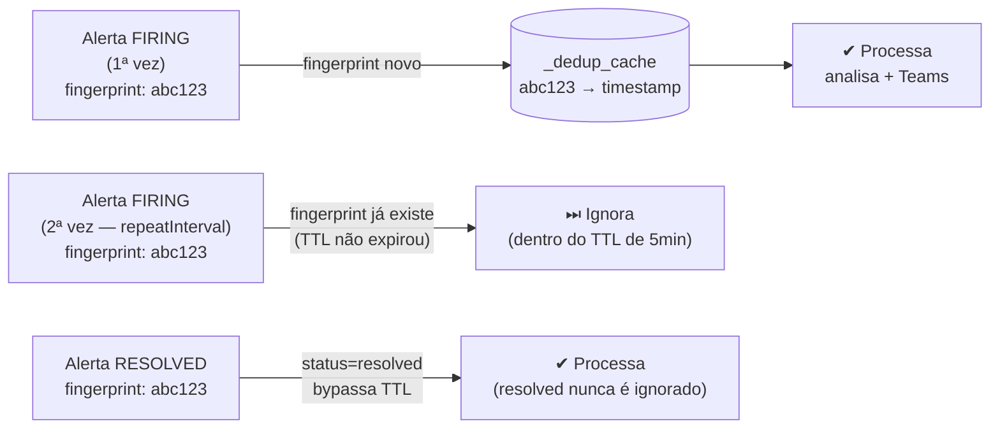

# Fluxo do Webhook Assíncrono

Por que o Alertmanager não fica travado e o que acontece em background.

---

## Comparativo: antes e depois

---

## Deduplicação por fingerprint

O Alertmanager reenvia o mesmo alerta a cada `repeatInterval` (padrão: 5 min).  
Sem deduplicação, cada reenvio dispararia uma nova análise LLM.

