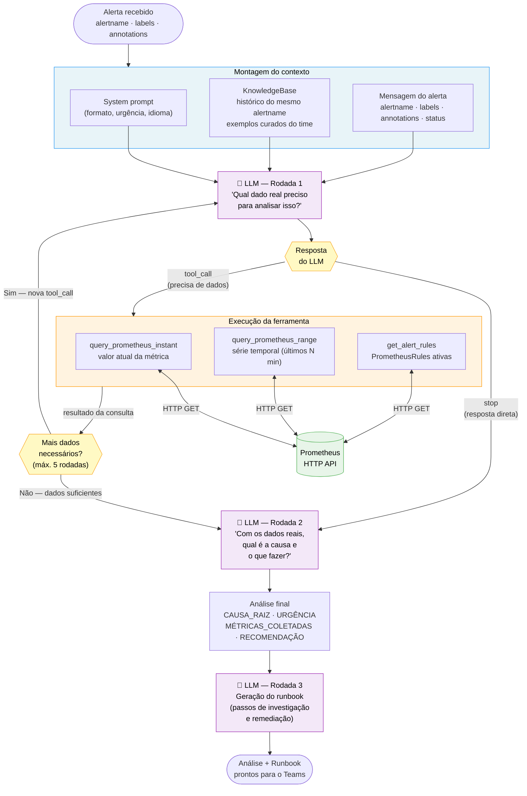

# ReAct Loop — Raciocínio Interno do Agente

Como o agente decide o que consultar, executa as ferramentas e chega à análise final.  
**ReAct = Reasoning + Acting** — o modelo raciocina sobre o que precisa e age para buscar.



---

## Por que esse padrão importa

**Sem ReAct (resposta genérica):**
```
Alerta: "Heap JVM alto"
LLM responde: "Possível problema de memória. Considere reiniciar o pod."
→ Inútil. Não tem dados reais. Poderia ser qualquer alerta.
```

**Com ReAct (dados reais):**
```
Alerta: "Heap JVM alto"
LLM pensa: "Preciso do valor atual do heap e da tendência."
LLM consulta: jvm_memory_used_bytes{pod="camunda-zeebe-0"} → 530 MB
LLM analisa: "530 de 614 MB (86%), crescendo +2 MB/min há 15 min.
              Padrão típico de jobs BPMN presos em retry loop."
LLM recomenda: passos específicos para aquele pod, naquele momento.
→ Acionável. Baseado em evidência.
```

## Limite de rodadas

O loop tem um máximo de **5 rodadas** (`MAX_TOOL_ROUNDS` em `reactive_agent.py`).  
Se o LLM continuar pedindo dados após o limite, o agente encerra com a análise parcial disponível.  
O histograma `aiops_llm_rounds_used` no dashboard mostra quantas rodadas cada análise usou.
